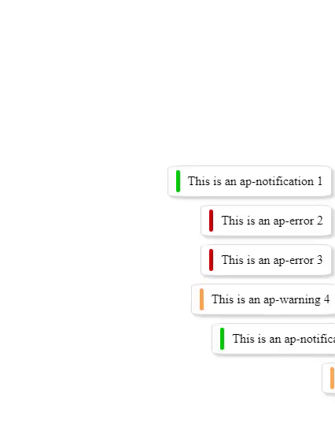

# AP NOTIFICATION

## v1.0.0

## Notification Class

### Usage

#### APNotification takes 2 optional parameters

#### -options: Object = 2 options

- position: String = where to position the notification container. Possible variables: "bottom-right" (default), "bottom-left", "top-right", "top-left";

- delay: Number = how long before the notification dissapears (5000ms or 5seconds default).

#### -container: HTMLDomElement = By default, the container appends to the end of the "body" element. By setting this parameter you can change that. Be aware that the container has position: fixed.

### <b>Functions</b>

#### The APNotification, added to the error, warning and notification listeners, acts like any other event listening implementation, so you can use the on, emit and removeListener functions to implemenet your own event listeners. The package comes with 3 default events:

- notification (green thumb);
- error (red thumb);
- warning (orange thumb).

#### - on: Function = sets an event listener. Takes 2 parameters:

- name: String = Event listener name
- callback: Function = Callback function with one parameter that will handle the data passed in the emit function.

#### - emit: Function = calls <b>every</b> listener of an event listener name. Takes 2 parameters:

- name: String = Event listener name
- data: Any = data passed to the listener handler

#### - removeListener: Function = remove a specific handler from an event listener. Takes 2 parameters:

- name: String = Event listener name
- callback: Function = the callback function that was passed in the handler (it uses a filter to remove the handler: events[name].filter((item) => item !== callback))

### Examples

```Javascript
    import { APNotification } from "../index.js";

    const APN = new APNotification({ position: "bottom-right" });

    const variations = ["warning", "error", "notification"];

    [1, 2, 3, 4, 5, 6, 7, 8, 9].forEach((item, index) => {
        setTimeout(() => {
            const currentVariation = variations[Math.floor(Math.random() * 3)];
            APN.emit(currentVariation, `This is an ap-${currentVariation}  ${item}`);
        }, 300 * index);
    });
```
### Result: 

<center>



</center>